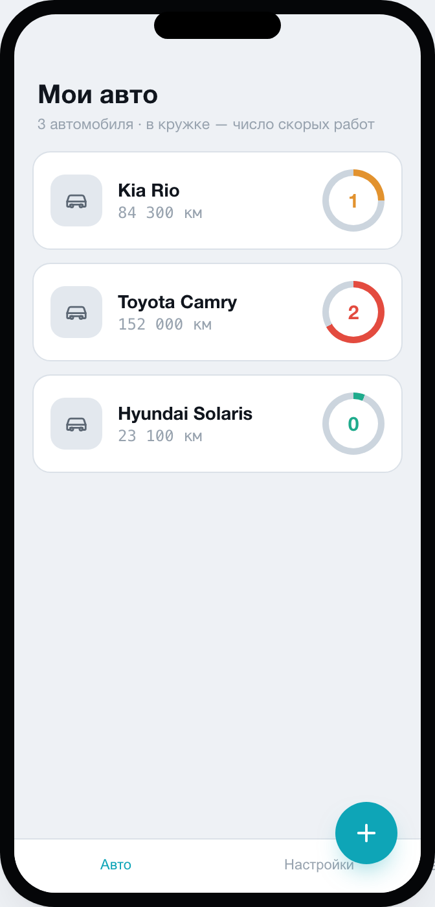
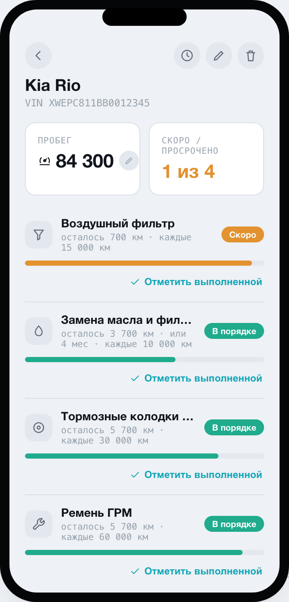
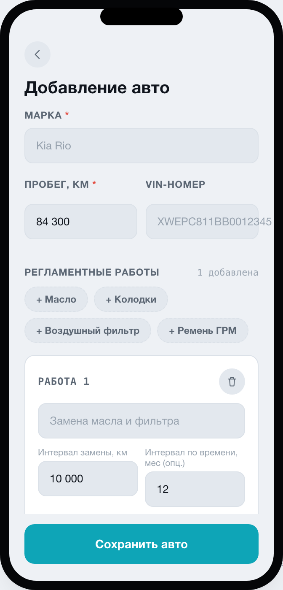
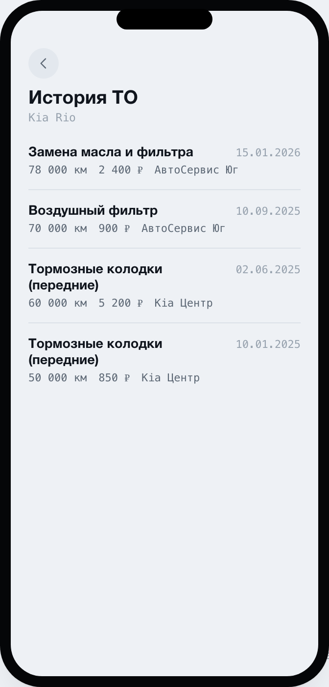
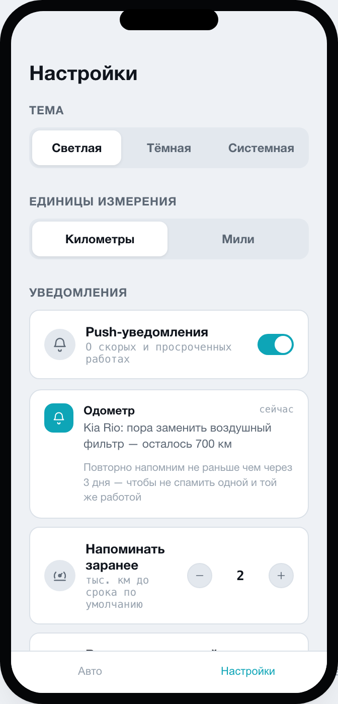
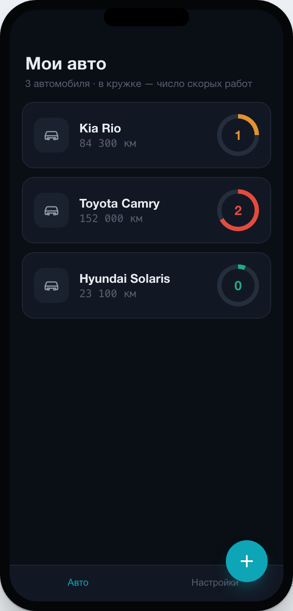
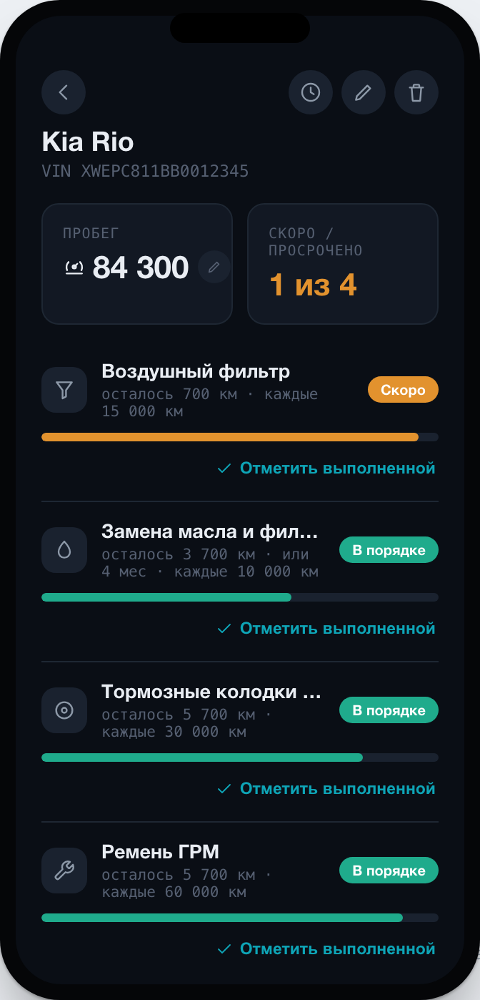
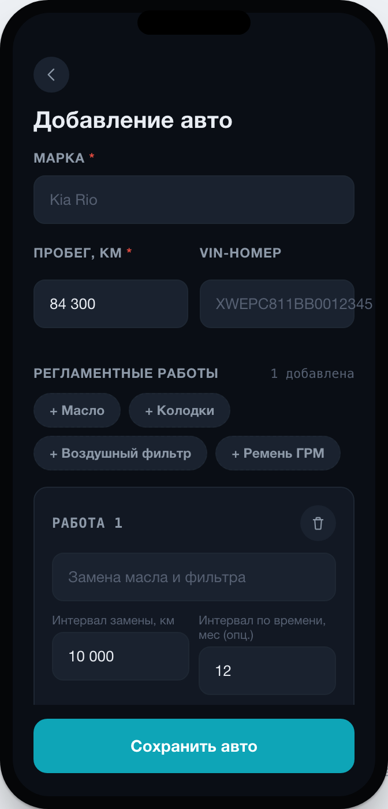
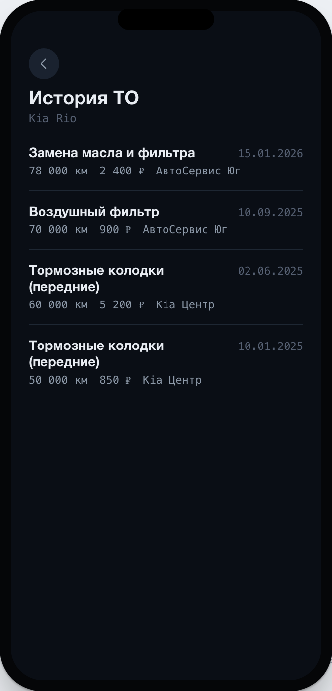
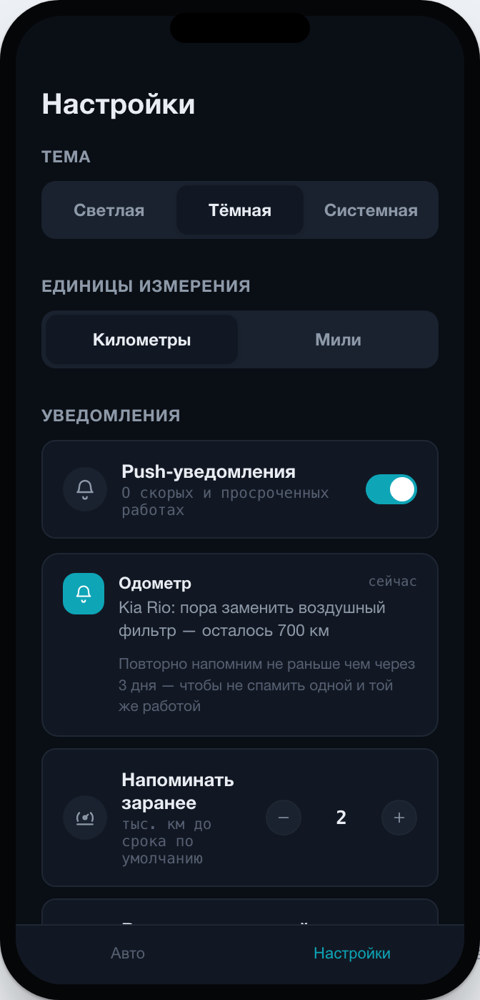

# Odometer
**Track car maintenance by mileage and time — whichever comes first.**
Odometer is a Kotlin Multiplatform app (Android + iOS, shared UI via Compose Multiplatform) for keeping your car's maintenance schedule under control. Every task — oil change, brake pads, timing belt — is tracked against both a mileage interval and an optional time interval, and its status is colored by whichever limit is closer: calm teal when there's plenty of room, amber once you enter the reminder window, red once it's overdue.
*(Russian version: [README.ru.md](README.ru.md))*

## Screenshots

  
  
  
  
  

  
  
  
  
  

## Features
- **Multi-car garage** — a list of all your cars with a gauge-ring indicator showing how many tasks are soon-due or overdue at a glance.
- **Dual-axis reminders** — every task tracks a mileage interval and, optionally, a time interval (months); status is driven by whichever limit is reached first, which matters for things like engine oil that age even if the car sits idle.
- **Three-tier color status** — OK / Soon / Overdue, with a consistent color language across the entire app and both themes.
- **Service history log** — every completed task is recorded with date, mileage, cost and service center, so you can look back at what was done and when.
- **One-tap "mark as done"** — update a task straight from the task list; progress and status recalculate instantly, no form required.
- **Quick mileage edit** — update your current mileage inline on the car screen without opening a full edit form.
- **Maintenance presets** — add a new car with ready-made task templates (oil, pads, air filter, timing belt) instead of typing every interval by hand.
- **Local push notifications** — get notified when a task enters its reminder window or becomes overdue, with anti-spam throttling so the same task doesn't repeat too often.
- **Light / dark / system theme** and **km / mi** unit switch.

## Tech stack
Kotlin Multiplatform · Compose Multiplatform (shared UI) · SQLDelight (local DB) · Koin (DI) — targeting Android and iOS from a single codebase.

## Status
In active development. See the design mockup and development plan for the full roadmap.
